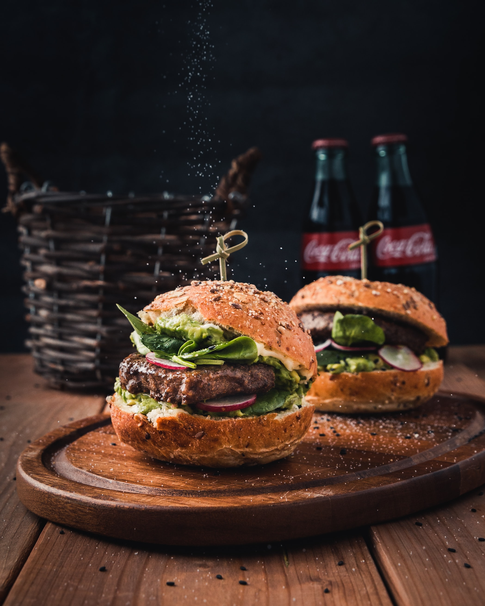

# Food-App

If you could take it you would have done so without hesitation!



Food-App est un service en ligne qui permet aux particuliers et aux entreprises de commander les plats de leurs restaurants préférés.

## Technologies


## Pour commencer

1 - Commencer par Cloner/Forker le projet :
[Cloner un dépôt](https://docs.github.com/en/repositories/creating-and-managing-repositories/cloning-a-repository) /
[Forker un dépôt](https://docs.github.com/en/get-started/quickstart/fork-a-repo)

2 - Lorsque vous êtes sur le projet, installez toutes les dépendances en exécutant depuis le terminal :

```sh
npm install
```

3 - Puis lancer le server en faisant :

```sh
npm start
```

## Prochaines fonctionnalités

<ul>
<li>
Concevoir des interfaces utilisateur
</li>
<li>
Concevoir, implémenter et utiliser des bases de données
</li>
<li>
Développer une application serveur avec Node.js et express
</li>
<li>
Implémenter l'achat de nourriture avec un système de paiement fictive
</li>
</ul>